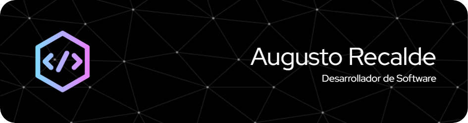

  

### Acerca de mí
Soy desarrollador de software con más de 7 años de experiencia y especialización en desarrollo web, me enfoco en crear soluciones innovadoras utilizando mayormente el Stack MERN (MySQL, Express.js, React.js, Node.js). Pero también poseo profundo conocimiento en PHP y PL-SQL.
 Durante mi trayectoria profesional, colaboré en el desarrollo de proyectos a cargo del área de sistemas de la provincia de Formosa, Argentina, así como también, brindando mentoría a pasantes y liderando el equipo de desarrollo en la misma institución.
Actualmente soy desarrollador web y Tech Lead del equipo en Fadel S.A.

## Tecnologías 💻

## Estadísticas 
 

